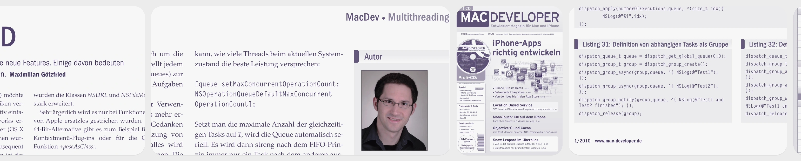

# Prepare your encrypted SQLite databases for the post-quantum future

Attackers are stealing encrypted databases today and storing them for later. Their hope is that future quantum computers will let them read what is protected now.

TextrunSQL adds post-quantum protection around the key that opens the database. [SQLCipher](https://www.zetetic.net/sqlcipher/) handles the encryption, while [SQLite](https://sqlite.org/) stores and queries the data.

<p align="center">
  <picture>
    <source media="(prefers-color-scheme: dark)" srcset="textrunsql/assets/diagrams/textrunsql-layers-dark.svg">
    <source media="(prefers-color-scheme: light)" srcset="textrunsql/assets/diagrams/textrunsql-layers.svg">
    
  </picture>
</p>

<p align="center"><em>TextrunSQL adds a post-quantum key layer.<br>It does NOT replace SQLCipher or SQLite.</em></p>

## Why post-quantum matters now

Nobody knows when a quantum computer powerful enough to break the public-key protection used today will arrive. Updating products and stored data takes time, so waiting for that day is risky.

Encrypted files and traffic can be copied today and stored for years. If the public-key layer that protected those keys later falls, old archives can open. Someone can steal encrypted databases now and wait.

That attack is called **harvest-now, decrypt-later**.

Governments and product teams are not waiting for a dramatic “quantum day”:

- **NIST** published its first [post-quantum standards](https://csrc.nist.gov/projects/post-quantum-cryptography) in August 2024 and provides guidance for moving existing systems to them.
- **Apple** introduced [PQ3](https://security.apple.com/blog/imessage-pq3/) for iMessage, combining established and post-quantum cryptography to reduce harvest-now, decrypt-later risk.
- **Signal** introduced and deployed [PQXDH](https://signal.org/docs/specifications/pqxdh/) in its apps, combining its existing key agreement with a post-quantum method.
- **Cloudflare** enabled [post-quantum key agreement](https://developers.cloudflare.com/ssl/post-quantum-cryptography/pqc-cloudflare-products/) broadly across its network and documented the rollout.

## The standards TextrunSQL uses

TextrunSQL wraps a database key with `ML-KEM-768` so a stolen envelope is harder to open later. This is a standard from [NIST FIPS 203](https://nvlpubs.nist.gov/nistpubs/FIPS/NIST.FIPS.203.pdf), implemented in [OpenSSL](https://github.com/openssl/openssl/blob/openssl-4.0.1/crypto/ml_kem/ml_kem.c).

The envelope also uses `SHA-256`, `HKDF-SHA-256`, and `AES-256-GCM`. This strong symmetric crypto can stay because it is much less exposed to known quantum attacks than public-key crypto, according to NIST.

Other standards and recommendations are not implemented, because they do not apply to TextrunSQL:

- **Hybrid KEMs**: Apple PQ3 and Signal PQXDH combine classical key exchange with a post-quantum `KEM`, but TextrunSQL is not a messaging handshake.
- **FIPS 204 and FIPS 205**: These cover signing and verification, not database key envelopes.
- **CNSA 2.0, TLS hybrids, and certificate PKI migration**: These are network and enterprise PKI concerns.

TextrunSQL only defines the envelope format. Audit claims, formal certification, storage, backups, key custody, sharing, rotation, and migration are left to the application.

## How TextrunSQL works

TextrunSQL protects the 32-byte key that opens the database. SQLCipher still encrypts and checks the database pages. Your app still decides where the database, envelope, private key, and recovery information live.

**Seal** protects the database key inside a 1236-byte **Envelope**. Bytes `0..1187` are authenticated but not encrypted, while the final 48 bytes contain the wrapped key and its tag.

**Open** checks the envelope, refuses changes or a different recipient or context, and returns the key only when all checks succeed. A separate **Handoff** then passes the key to SQLCipher.

<p align="center">
  <picture>
    <source media="(prefers-color-scheme: dark)" srcset="textrunsql/assets/diagrams/textrunsql-seal-dark.svg">
    <source media="(prefers-color-scheme: light)" srcset="textrunsql/assets/diagrams/textrunsql-seal.svg">
    
  </picture>
</p>
<p align="center">
  <picture>
    <source media="(prefers-color-scheme: dark)" srcset="textrunsql/assets/diagrams/textrunsql-open-handoff-dark.svg">
    <source media="(prefers-color-scheme: light)" srcset="textrunsql/assets/diagrams/textrunsql-open-handoff.svg">
    
  </picture>
</p>

**What the labels mean:**

- **`AAD` (Additional Authenticated Data):** Envelope bytes `0..1187`, which `AES-GCM` authenticates but does not encrypt.
- **`AES-GCM` / `GCM`:** The diagram’s short labels for `AES-256-GCM`, which TextrunSQL uses to wrap the `DEK` and authenticate the envelope prefix.
- **Bind:** Computes `rid = SHA-256(pk)` and `chash = SHA-256(context)` so Open can reject a different recipient or context.
- **`chash` (context hash):** The 32-byte `SHA-256` digest of the caller context, stored in the envelope and used as the `HKDF` salt.
- **`context`:** A nonempty, app-defined binary value from 1 through 1024 bytes, supplied unchanged to Seal & Open as a stable database-context identifier.
- **Decaps:** Uses the matching `ML-KEM` decapsulation key and `KEM` ciphertext to produce the shared secret.
- **`DEK` (database encryption key):** The random 32-byte database encryption key supplied to SQLCipher in raw-key form.
- **Derive:** Uses `HKDF-SHA-256` with the shared secret, context hash, and fixed protocol label to produce the `AES-GCM` wrapping key.
- **Encapsulate:** Uses the recipient’s `ML-KEM` encapsulation key to produce a 1088-byte `KEM` ciphertext and 32-byte shared secret.
- **Envelope:** The fixed 1236-byte record containing the header, recipient and context bindings, `KEM` ciphertext, `nonce`, wrapped `DEK`, and tag.
- **Format:** Converts the recovered `DEK` into SQLCipher’s lowercase raw-key syntax. That syntax uses the prefix `x'`, exactly 64 hex digits, and a closing `'`.
- **`GCM` output:** Envelope bytes `1188..1235` contain the 32-byte wrapped `DEK` followed by its 16-byte authentication tag.
- **Handoff:** The separate caller-controlled step that formats the recovered `DEK` and applies it to an already-open SQLCipher database.
- **`hdr` (header):** The fixed 24-byte envelope header containing the magic, version, suite, flags, reserved bytes, and declared lengths.
- **`HKDF` (HMAC-based Key Derivation Function):** The key-derivation function that combines the shared secret, context hash, and fixed protocol label to produce the wrapping key.
- **Input:** Open receives the `envelope`, matching recipient `key`, and unchanged `context`. Handoff receives the open `db`, selected `schema`, and recovered `DEK`.
- **`KEM` ciphertext:** The 1088-byte `ML-KEM` output that the matching decapsulation key uses to produce the same shared secret.
- **`ML-KEM-768` (Module-Lattice-Based Key-Encapsulation Mechanism):** The FIPS 203 parameter set used by TextrunSQL. NIST classifies it in security category 3. `768` is a parameter-set name, not a key size.
- **`nonce`:** A fresh random 12-byte `AES-GCM` input stored in the envelope. It must not repeat with the same wrapping key.
- **Open:** Authenticates an envelope for the matching recipient and context and returns the `DEK`. It does not itself apply the `DEK` to SQLCipher. The tests below check both its success and failure paths.
- **`pk` (public key):** The recipient’s 1184-byte `ML-KEM` encapsulation key, also called the public key in this API.
- **`rid` (recipient identifier):** The 32-byte `SHA-256` digest of `pk`, stored in the envelope and checked during Open.
- **Seal:** Creates the canonical 1236-byte envelope that protects one 32-byte `DEK` for one recipient and context.
- **Set key:** Calls `sqlite3_key_v2()` with the formatted raw key for the selected schema.
- **`SHA-256`:** The hash function used to compute `rid` from `pk` and `chash` from the context.
- **SQLCipher:** The SQLite-compatible library that encrypts and authenticates database pages after the `DEK` is applied.
- **`sqlite3_key_v2()`:** The SQLCipher API that applies the formatted key to the selected schema. Success means the key was accepted, not that existing database content was authenticated.
- **`tag`:** The 16-byte `AES-GCM` authentication tag covering the wrapped `DEK` and the AAD.
- **`textrunsql_pq_key_sqlcipher()`:** Formats the 32-byte `DEK` as a SQLCipher raw key and calls `sqlite3_key_v2()`. Success sets the key but does not authenticate existing database content. The caller must read protected content next.
- **`textrunsql_pq_open_dek()`:** Validates and authenticates the envelope and returns the 32-byte `DEK` only on success. The output remains zero on failure.
- **`textrunsql_pq_seal_dek()`:** Seals a supplied 32-byte `DEK` into a 1236-byte envelope for one recipient and context.
- **Unwrap:** Uses `AES-GCM` to authenticate the AAD and wrapped `DEK`, then releases the recovered `DEK` only if authentication succeeds.
- **Validate:** Checks the exact envelope format, version, suite, recipient binding, and context binding before decapsulation.
- **`wDEK` (wrapped `DEK`):** The 32-byte `AES-GCM` ciphertext of the `DEK` stored in the envelope.
- **Wrap:** Uses the derived key and random `nonce` to `AES-GCM`-encrypt the `DEK` and authenticate the AAD, producing `wDEK` and the tag.

## How to test this

The tests follow the Seal & Open paths in the diagrams above. They check that Seal creates an envelope that Open can read, that the recovered `DEK` opens the SQLCipher database, and that Open refuses changed data, the wrong recipient, or the wrong context.

Start with the regular checks. After you have configured the repo with OpenSSL 3.5 or newer, run these commands from its root:

```sh
make libsqlite3.a testfixture
./testfixture test/sqlcipher.test
make -C textrunsql check
```

The first two commands build SQLCipher and run its own checks. The last command tests TextrunSQL, including NIST examples, the Seal & Open behavior above, and the handoff of the recovered key to SQLCipher. The full setup and exact coverage are in [textrunsql/TESTING.md](https://github.com/textrun/TextrunSQL/blob/main/textrunsql/TESTING.md).

For deeper checks, run two more commands that look for memory errors or parser crashes:

```sh
make -C textrunsql asan
make -C textrunsql fuzz-smoke
```

`asan` reruns the focused C tests with checks for memory errors and undefined behavior. `fuzz-smoke` sends 5,000 generated inputs through the envelope parser and looks for crashes, memory errors, or undefined behavior.

Passing these tests shows that the code worked in the setup you used: this commit, compiler, operating system, OpenSSL provider, architecture, and build settings. It is not a security review or certification, and it cannot cover every way an app or its environment might expose the database or its keys.

## Why we don't encrypt the entire envelope

Open needs the envelope’s header, recipient and context bindings, `ML-KEM` ciphertext, and `nonce` before it can derive the key that unwraps the database key. Encrypting those fields with that same key would create a circle: Open would need the key to read the data required to derive it.

Those fields are not secret. They remain readable, but `AES-GCM` authenticates them as `AAD`, so Open rejects the envelope if any of them change. The database key is the part that needs to stay hidden, so TextrunSQL encrypts it and uses the authentication tag to protect both it and the visible fields.

## Why we don't use something that already exists

SQLCipher currently does not provide post-quantum protection for the key. There is also no fork that does. TextrunSQL adds that missing layer and relies on existing cryptographic code:

- **OpenSSL**: TextrunSQL calls OpenSSL for `ML-KEM` instead of implementing the algorithm itself.
- **A current standard**: OpenSSL’s `ML-KEM` conforms to FIPS 203, and its 3.5 release has [long-term support through April 2030](https://openssl-library.org/post/2025-04-08-openssl-35-final-release/).
- **Used elsewhere**: [NGINX](https://blog.nginx.org/blog/pqc-nginx) and [HAProxy](https://cdn.haproxy.com/blog/how-to-enable-post-quantum-cryptography-and-tls-termination-with-haproxy) also use OpenSSL’s post-quantum support for TLS. Their protocols are different, but the `ML-KEM` code comes from the same maintained library.

## How to learn more

These talks explain the ideas behind post-quantum cryptography, why the change matters now, and how `ML-KEM` is being used:

- **Tomas Gustavsson @ OpenSSL Conference 2025**

  [youtube.com/watch?v=VqCi1rBBtgg](https://www.youtube.com/watch?v=VqCi1rBBtgg) • 25 min

  Tomas from [Refactor.com](https://www.keyfactor.com/about-us/) shows hybrid `ML-KEM` TLS working out of the box with OpenSSL 3.5, then examines the remaining gaps across certificates, browsers, and hardware security modules.

- **Sophie Schmieg & Bas Westerbaan @ RWPQC 2026**

  [youtube.com/watch?v=vndzs8l16Tc](https://www.youtube.com/watch?v=vndzs8l16Tc) • 78 min

  Sophie from Google and Bas from Cloudflare describe how hybrid `ML-KEM` reached production TLS. They explain why store-now, decrypt-later makes key exchange urgent, while signatures, certificates, and legacy systems make the rest of the migration much harder.

- **Jeff Crume @ IBM Technology 2026**

  [youtube.com/watch?v=ZRpcYSghGr8](https://www.youtube.com/watch?v=ZRpcYSghGr8) • 14 min

  Jeff uses a chessboard analogy to explain how high-dimensional lattices and added noise create problems that neither classical nor quantum computers can solve efficiently. He then connects the idea to harvest-now, decrypt-later and why encrypted data with a long useful life needs protection now.

## About the dev who built this

Maximilian Götzfried is a freelance developer from Germany. For more than two decades, he has shipped apps that use encrypted databases.

Apple recognized his work early with a student scholarship for [WWDC](https://wikipedia.org/wiki/Worldwide_Developers_Conference) in 2006.

> This was about six months before Apple introduced the iPhone, and Steve Jobs was already dealing with severe health issues. At the beginning of the keynote, he told us that he was feeling better. That remark was later cut from the video recording. At the time, Apple still held full sessions in person, with long Q&As before live audiences at San Francisco’s Moscone Center. – [max@text.run](mailto:max@text.run)

His expertise in high-performance concurrency goes back to 2008, when he shipped iPhoneOS 2.0 apps with manually managed [pthreads](https://developer.apple.com/library/archive/documentation/System/Conceptual/ManPages_iPhoneOS/man3/pthread.3.html) because [NSOperationQueue](https://developer.apple.com/documentation/foundation/operationqueue?language=objc) had too much overhead.

The German *Mac Developer* magazine published his 15-page [Snow Leopard](https://wikipedia.org/wiki/Mac_OS_X_Snow_Leopard) special in 2010. Featured on the issue’s cover, it covered 64-bit development, Clang LLVM, Apple’s then-new [Dispatch](https://developer.apple.com/documentation/dispatch) framework, and other multithreading topics.

<p align="center">
  <picture>
    <source media="(prefers-color-scheme: dark)" srcset="textrunsql/assets/magazine/about-strip-dark@3x.webp">
    <source media="(prefers-color-scheme: light)" srcset="textrunsql/assets/magazine/about-strip@3x.webp">
    
  </picture>
</p>

<p align="center"><em>Maximilian Götzfried in <cite>Mac Developer</cite>, 2010 — with a lot more hair than today.</em></p>

He started programming in Swift with version 1.0 in 2014 and released [MXStatusMenu](https://github.com/st400/MXStatusMenu) as an early project with [manual memory management](https://developer.apple.com/documentation/swift/manual-memory-management).

In recent years, he has migrated several high-profile projects and parsers to [strict concurrency](https://developer.apple.com/documentation/swift/adoptingswift6) and optimized native app performance with [contiguous memory](https://developer.apple.com/documentation/Foundation/ContiguousBytes), [Metal](https://developer.apple.com/documentation/metal), [SIMD](https://developer.apple.com/documentation/swift/simd), and other advanced technologies.

His current focus is **Textrun**, a personal archiving and research app that will use TextrunSQL to ship post-quantum protection to its customers.

## How AI helped build this

Maximilian Götzfried sees AI as a useful tool for developers, but does not believe that coding is “solved.”

> I have always enjoyed writing code, and I will never give that up. I use AI as a supporting tool, similar to code generators and automations in the past. To write code and explore new ideas. I also use AI to improve my English because it is not my first language, and to learn new things by having it explain them to me.
>
> I use AI to ship the best product I can and to become a better developer. But I am not a vibe coder. I write a lot of code every day, thoroughly review every AI contribution and try to get to the bottom of every issue – because I care about quality.
>
>  – [max@text.run](mailto:max@text.run)

---

The original SQLCipher README follows unchanged.

## SQLCipher

SQLCipher is a standalone fork of the [SQLite](https://www.sqlite.org/) database library that adds 256 bit AES encryption of database files and other security features like:

- on-the-fly encryption
- tamper detection
- memory sanitization
- strong key derivation

SQLCipher is based on SQLite and stable upstream release features are periodically integrated. While SQLCipher is maintained as a separate version of the source tree, the project minimizes alterations to core SQLite code whenever possible.

SQLCipher is maintained by Zetetic, LLC, and additional information and documentation is available on the official [SQLCipher site](https://www.zetetic.net/sqlcipher/).

## Features

- Fast performance with as little as 5-15% overhead for encryption on many operations
- 100% of data in the database file is encrypted
- Good security practices (CBC mode, HMAC, key derivation)
- Zero-configuration and application level cryptography
- Support for multiple cryptographic providers

## Compatibility

SQLCipher maintains database format compatibility within the same major version number so an application on any platform can open databases created by any other application provided the major version of SQLCipher is the same between them. However, major version updates (e.g. from 3.x to 4.x) often include changes to default settings. This means that newer major versions of SQLCipher will not open databases created by older versions without using special settings. For example, SQLCipher 4 introduces many new performance and security enhancements. The new default algorithms, increased KDF iterations, and larger page size mean that SQLCipher 4 will not open databases created by SQLCipher 1.x, 2.x, or 3.x by default. Instead, an application would either need to migrate the older databases to use the new format or enable a special backwards-compatibility mode. The available options are described in SQLCipher's [upgrade documentation](https://discuss.zetetic.net/t/upgrading-to-sqlcipher-4/3283). 

SQLCipher is also compatible with standard SQLite databases. When a key is not provided, SQLCipher will behave just like the standard SQLite library. It is also possible to convert from a plaintext database (standard SQLite) to an encrypted SQLCipher database using [ATTACH and the sqlcipher_export() convenience function](https://discuss.zetetic.net/t/how-to-encrypt-a-plaintext-sqlite-database-to-use-sqlcipher-and-avoid-file-is-encrypted-or-is-not-a-database-errors/868).

## Contributions

The SQLCipher team welcomes contributions to the core library. All contributions including pull requests and patches should be based on the `prerelease` branch, and must be accompanied by a [contributor agreement](https://www.zetetic.net/contributions/). We strongly encourage [discussion](https://discuss.zetetic.net/c/sqlcipher) of the proposed change prior to development and submission.

## Compiling

Building SQLCipher is similar to compiling a regular version of SQLite from source, with a few small exceptions. You must:

 1. define `SQLITE_HAS_CODEC`
 2. define `SQLITE_TEMP_STORE=2` or `SQLITE_TEMP_STORE=3` (or use `configure`'s --with-tempstore=yes option)
 3. define `SQLITE_EXTRA_INIT=sqlcipher_extra_init` and `SQLITE_EXTRA_SHUTDOWN=sqlcipher_extra_shutdown`
 4. define `SQLITE_THREADSAFE` to `1` or `2` (enabled automatically by `configure`)
 2. compile and link with a supported cryptographic provider (OpenSSL, LibTomCrypt, CommonCrypto/Security.framework, or NSS)

The following examples demonstrate use of OpenSSL, which is a readily available provider on most Unix-like systems. Note that, in this example, `--with-tempstore=yes` is setting `SQLITE_TEMP_STORE=2` for the build, and `SQLITE_THREADSAFE` has a default value of `1`.

```
$ ./configure --with-tempstore=yes CFLAGS="-DSQLITE_HAS_CODEC -DSQLITE_EXTRA_INIT=sqlcipher_extra_init -DSQLITE_EXTRA_SHUTDOWN=sqlcipher_extra_shutdown" \
	LDFLAGS="-lcrypto"
$ make
```

## Testing

The full SQLite test suite will not complete successfully when using SQLCipher. In some cases encryption interferes with low-level tests that require access to database file data or features which are unsupported by SQLCipher. Those tests that are intended to support encryption are intended for non-SQLCipher implementations. In addition, because SQLite tests are not always isolated, if one test fails it can trigger a domino effect with other failures in later steps.

As a result, the SQLCipher package includes it's own independent tests that exercise and verify the core functionality of the SQLCipher extensions. This test suite is intended to provide an abbreviated verification of SQLCipher's internal logic; it does not perform an exhaustive test of the SQLite database system as a whole or verify functionality on specific platforms. Because SQLCipher is based on stable upstream builds of SQLite, it is considered a basic assumption that the core SQLite library code is operating properly (the SQLite core is almost untouched in SQLCipher). Thus, the additional SQLCipher-specific test provide the requisite verification that the library is operating as expected with SQLCipher's security features enabled.

To run SQLCipher specific tests, configure as described here and run the following to execute the tests and receive a report of the results:

```
$ ./configure --with-tempstore=yes --enable-fts5 CFLAGS="-DSQLITE_HAS_CODEC -DSQLITE_EXTRA_INIT=sqlcipher_extra_init -DSQLITE_EXTRA_SHUTDOWN=sqlcipher_extra_shutdown -DSQLCIPHER_TEST" \
	LDFLAGS="-lcrypto"
$ make testfixture
$ ./testfixture test/sqlcipher.test
```

## Encrypting a database

To specify an encryption passphrase for the database via the SQL interface you 
use a PRAGMA. The passphrase you enter is passed through PBKDF2 key derivation to
obtain the encryption key for the database 

	PRAGMA key = 'passphrase';

Alternately, you can specify an exact byte sequence using a blob literal. If you
use this method it is your responsibility to ensure that the data you provide is a
64 character hex string, which will be converted directly to 32 bytes (256 bits) of 
key data without key derivation.

	PRAGMA key = "x'2DD29CA851E7B56E4697B0E1F08507293D761A05CE4D1B628663F411A8086D99'";

To encrypt a database programmatically you can use the `sqlite3_key` function. 
The data provided in `pKey` is converted to an encryption key according to the 
same rules as `PRAGMA key`. 

	int sqlite3_key(sqlite3 *db, const void *pKey, int nKey);

`PRAGMA key` or `sqlite3_key` should be called as the first operation when a database is open.

## Changing a database key

To change the encryption passphrase for an existing database you may use the rekey PRAGMA
after you've supplied the correct database password;

	PRAGMA key = 'passphrase'; -- start with the existing database passphrase
	PRAGMA rekey = 'new-passphrase'; -- rekey will reencrypt with the new passphrase

The hex rekey pragma may be used to rekey to a specific binary value

	PRAGMA rekey = "x'2DD29CA851E7B56E4697B0E1F08507293D761A05CE4D1B628663F411A8086D99'";

This can be accomplished programmatically by using sqlite3_rekey;

	sqlite3_rekey(sqlite3 *db, const void *pKey, int nKey)

## Support

The primary source for complete documentation (design, API, platforms, usage) is the SQLCipher website:

https://www.zetetic.net/sqlcipher/documentation

The primary avenue for support and discussions is the SQLCipher discuss site:

https://discuss.zetetic.net/c/sqlcipher

Issues or support questions on using SQLCipher should be entered into the 
GitHub Issue tracker:

https://github.com/sqlcipher/sqlcipher/issues

Please DO NOT post issues, support questions, or other problems to blog 
posts about SQLCipher as we do not monitor them frequently.

If you are using SQLCipher in your own software please let us know at 
support@zetetic.net!

## Community Edition Open Source License

Copyright (c) 2025, ZETETIC LLC
All rights reserved.

Redistribution and use in source and binary forms, with or without
modification, are permitted provided that the following conditions are met:
    * Redistributions of source code must retain the above copyright
      notice, this list of conditions and the following disclaimer.
    * Redistributions in binary form must reproduce the above copyright
      notice, this list of conditions and the following disclaimer in the
      documentation and/or other materials provided with the distribution.
    * Neither the name of the ZETETIC LLC nor the
      names of its contributors may be used to endorse or promote products
      derived from this software without specific prior written permission.

THIS SOFTWARE IS PROVIDED BY ZETETIC LLC ''AS IS'' AND ANY
EXPRESS OR IMPLIED WARRANTIES, INCLUDING, BUT NOT LIMITED TO, THE IMPLIED
WARRANTIES OF MERCHANTABILITY AND FITNESS FOR A PARTICULAR PURPOSE ARE
DISCLAIMED. IN NO EVENT SHALL ZETETIC LLC BE LIABLE FOR ANY
DIRECT, INDIRECT, INCIDENTAL, SPECIAL, EXEMPLARY, OR CONSEQUENTIAL DAMAGES
(INCLUDING, BUT NOT LIMITED TO, PROCUREMENT OF SUBSTITUTE GOODS OR SERVICES;
LOSS OF USE, DATA, OR PROFITS; OR BUSINESS INTERRUPTION) HOWEVER CAUSED AND
ON ANY THEORY OF LIABILITY, WHETHER IN CONTRACT, STRICT LIABILITY, OR TORT
(INCLUDING NEGLIGENCE OR OTHERWISE) ARISING IN ANY WAY OUT OF THE USE OF THIS
SOFTWARE, EVEN IF ADVISED OF THE POSSIBILITY OF SUCH DAMAGE.

# Begin SQLite README.md

<h1 align="center">SQLite Source Repository</h1>

This repository contains the complete source code for the
[SQLite database engine](https://sqlite.org/) going back
to 2000-05-29.  The tree includes many tests and some
documentation, though additional tests and most documentation
are managed separately.

See the [on-line documentation](https://sqlite.org/) for more information
about what SQLite is and how it works from a user's perspective.  This
README file is about the source code that goes into building SQLite,
not about how SQLite is used.

## Version Control

SQLite sources are managed using
[Fossil](https://fossil-scm.org/), a distributed version control system
that was specifically designed and written to support SQLite development.
The [Fossil repository](https://sqlite.org/src/timeline) contains the urtext.

If you are reading this on GitHub or some other Git repository or service,
then you are looking at a mirror.  The names of check-ins and
other artifacts in a Git mirror are different from the official
names for those objects.  The official names for check-ins are
found in a footer on the check-in comment for authorized mirrors.
The official check-in name can also be seen in the `manifest.uuid` file
in the root of the tree.  Always use the official name, not  the
Git-name, when communicating about an SQLite check-in.

If you pulled your SQLite source code from a secondary source and want to
verify its integrity, there are hints on how to do that in the
[Verifying Code Authenticity](#vauth) section below.

## Contacting The SQLite Developers

The preferred way to ask questions or make comments about SQLite or to
report bugs against SQLite is to visit the 
[SQLite Forum](https://sqlite.org/forum) at <https://sqlite.org/forum/>.
Anonymous postings are permitted.

If you think you have found a bug that has security implications and
you do not want to report it on the public forum, you can send a private
email to drh at sqlite dot org.

## Public Domain

The SQLite source code is in the public domain.  See
<https://sqlite.org/copyright.html> for details. 

Because SQLite is in the public domain, we do not normally accept pull
requests, because if we did take a pull request, the changes in that
pull request might carry a copyright and the SQLite source code would
then no longer be fully in the public domain.

## Obtaining The SQLite Source Code

Source code tarballs or ZIP archives are available at:

  *  [Latest trunk check-in](https://sqlite.org/src/rchvdwnld/trunk).

  *  [Latest release](https://sqlite.org/src/rchvdwnld/release)

  *  For other check-ins, browse the
     [project timeline](https://sqlite.org/src/timeline?y=ci) and
     click on the check-in hash of the check-in you want to download.
     On the resulting "info" page, click one of the options to the
     right of the "**Downloads:**" label in the "**Overview**" section
     near the top.

To access sources directly using [Fossil](https://fossil-scm.org/home),
first install Fossil version 2.0 or later.
Source tarballs and precompiled binaries for Fossil are available at
<https://fossil-scm.org/home/uv/download.html>.  Fossil is
a stand-alone program.  To install, simply download or build the single
executable file and put that file someplace on your $PATH or %PATH%.
Then run commands like this:

        mkdir -p ~/sqlite
        cd ~/sqlite
        fossil open https://sqlite.org/src

The initial "fossil open" command will take two or three minutes.  Afterwards,
you can do fast, bandwidth-efficient updates to the whatever versions
of SQLite you like.  Some examples:

        fossil update trunk             ;# latest trunk check-in
        fossil update release           ;# latest official release
        fossil update trunk:2024-01-01  ;# First trunk check-in after 2024-01-01
        fossil update version-3.39.0    ;# Version 3.39.0

Or type "fossil ui" to get a web-based user interface.

## Compiling for Unix-like systems

First create a directory in which to place
the build products.  It is recommended, but not required, that the
build directory be separate from the source directory.  Cd into the
build directory and then from the build directory run the configure
script found at the root of the source tree.  Then run "make".
See the [compile-for-unix.md](doc/compile-for-unix.md) document for
more detail.

For example:

        apt install gcc make tcl-dev  ;#  Install the necessary build tools
        tar xzf sqlite.tar.gz         ;#  Unpack the source tree into "sqlite"
        mkdir bld                     ;#  Build happens in a sibling directory
        cd bld                        ;#  Change to the build directory
        ../sqlite/configure           ;#  Run the configure script
        make sqlite3                  ;#  The "sqlite3" command-line tool
        make sqlite3.c                ;#  The "amalgamation" source file
        make sqldiff                  ;#  The "sqldiff" command-line tool
        #### Targets below require tcl-dev ####
        make tclextension-install     ;#  Install the SQLite TCL extension
        make devtest                  ;#  Run development tests
        make releasetest              ;#  Run full release tests
        make sqlite3_analyzer         ;#  Builds the "sqlite3_analyzer" tool

See the makefile for additional targets.  For debugging builds, the
core developers typically run "configure" with options like this:

        ../sqlite/configure --all --debug CFLAGS='-O0 -g'

For release builds, the core developers usually do:

        ../sqlite/configure --all

Core deliverables (sqlite3.c, sqlite3) can be built without a TCL, but
many makefile targets require a "tclsh" TCL interpreter version 8.6
or later.  The "tclextension-install" target and the test targets that follow
all require TCL development libraries too.  ("apt install tcl-dev").  It is
helpful, but is not required, to install the SQLite TCL extension (the
"tclextension-install" target) prior to running tests.  The "releasetest"
target has additional requirements, such as "valgrind".

On "make" command-lines, one can add "OPTIONS=..." to specify additional
compile-time options over and above those set by ./configure.  For example,
to compile with the SQLITE_OMIT_DEPRECATED compile-time option, one could say:

        ./configure --all
        make OPTIONS=-DSQLITE_OMIT_DEPRECATED sqlite3

The configure script uses [autosetup](https://msteveb.github.io/autosetup/).
If the configure script does not work out for you, there is a generic
makefile named "Makefile.linux-gcc" in the top directory of the source tree
that you can copy and edit to suit your needs.  Comments on the generic
makefile show what changes are needed.

## Compiling for Windows Using MSVC

On Windows, everything can be compiled with MSVC.
You will also need a working installation of TCL if you want to run tests,
though TCL is not required if you just want to build SQLite itself.
See the [compile-for-windows.md](doc/compile-for-windows.md) document for
additional information about how to install MSVC and TCL and configure your
build environment.

If you want to run tests, you need to let SQLite know the location of your
TCL library, using a command like this:

        set TCLDIR=c:\Tcl

SQLite itself does not contain any TCL code, but it does use TCL to run
tests. You may need to install TCL development libraries in order to
successfully complete some makefile targets. It is helpful, but is not
required, to install the SQLite TCL extension (the "tclextension-install"
target) prior to running tests.

The source tree contains a "make.bat" file that allows the same "make"
commands of Unix to work on Windows.  In the following, you can substitute
"nmake /f Makefile.msc" in place of "make", if you prefer to avoid this BAT
file:

        make sqlite3.exe
        make sqlite3.c
        make sqldiff.exe
        #### Targets below require TCL development libraries ####
        make tclextension-install
        make devtest
        make releasetest
        make sqlite3_analyzer.exe

There are many other makefile targets.  See comments in Makefile.msc for
details.

As with the unix Makefile, the OPTIONS=... argument can be passed on the nmake
command-line to enable new compile-time options.  For example:

        make OPTIONS=-DSQLITE_OMIT_DEPRECATED sqlite3.exe

## Source Tree Map

  *  **src/** - This directory contains the primary source code for the
     SQLite core.  For historical reasons, C-code used for testing is
     also found here.  Source files intended for testing begin with "`test`".
     The `tclsqlite3.c` and `tclsqlite3.h` files are the TCL interface
     for SQLite and are also not part of the core.

  *  **test/** - This directory and its subdirectories contains code used
     for testing.  Files that end in "`.test`" are TCL scripts that run
     tests using an augmented TCL interpreter named "testfixture".  Use
     a command like "`make testfixture`" to build that
     augmented TCL interpreter, then run individual tests using commands like
     "`testfixture test/main.test`".  This test/ subdirectory also contains
     additional C code modules and scripts for other kinds of testing.

  *  **tool/** - This directory contains programs and scripts used to
     build some of the machine-generated code that goes into the SQLite
     core, as well as to build and run tests and perform diagnostics.
     The source code to [the Lemon parser generator](./doc/lemon.html) is
     found here.  There are also TCL scripts used to build and/or transform
     source code files.  For example, the tool/mksqlite3h.tcl script reads
     the src/sqlite.h.in file and uses it as a template to construct
     the deliverable "sqlite3.h" file that defines the SQLite interface.

  *  **ext/** - Various extensions to SQLite are found under this
     directory.  For example, the FTS5 subsystem is in "ext/fts5/".
     Some of these extensions (ex: FTS3/4, FTS5, RTREE) might get built
     into the SQLite amalgamation, but not all of them.  The
     "ext/misc/" subdirectory contains an assortment of one-file extensions,
     many of which are omitted from the SQLite core, but which are included
     in the [SQLite CLI](https://sqlite.org/cli.html).
     
  *  **doc/** - Some documentation files about SQLite internals are found
     here.  Note, however, that the primary documentation designed for
     application developers and users of SQLite is in a completely separate
     repository.  Note also that the primary API documentation is derived
     from specially constructed comments in the src/sqlite.h.in file.

### Generated Source Code Files

Several of the C-language source files used by SQLite are generated from
other sources rather than being typed in manually by a programmer.  This
section will summarize those automatically-generated files.  To create all
of the automatically-generated files, simply run "make target&#95;source".
The "target&#95;source" make target will create a subdirectory "tsrc/" and
fill it with all the source files needed to build SQLite, both
manually-edited files and automatically-generated files.

The SQLite interface is defined by the **sqlite3.h** header file, which is
generated from src/sqlite.h.in, ./manifest.uuid, and ./VERSION.  The
[Tcl script](https://www.tcl.tk) at tool/mksqlite3h.tcl does the conversion.
The manifest.uuid file contains the SHA3 hash of the particular check-in
and is used to generate the SQLITE\_SOURCE\_ID macro.  The VERSION file
contains the current SQLite version number.  The sqlite3.h header is really
just a copy of src/sqlite.h.in with the source-id and version number inserted
at just the right spots. Note that comment text in the sqlite3.h file is
used to generate much of the SQLite API documentation.  The Tcl scripts
used to generate that documentation are in a separate source repository.

The SQL language parser is **parse.c** which is generated from a grammar in
the src/parse.y file.  The conversion of "parse.y" into "parse.c" is done
by the [lemon](./doc/lemon.html) LALR(1) parser generator.  The source code
for lemon is at tool/lemon.c.  Lemon uses the tool/lempar.c file as a
template for generating its parser.
Lemon also generates the **parse.h** header file, at the same time it
generates parse.c.

The **opcodes.h** header file contains macros that define the numbers
corresponding to opcodes in the "VDBE" virtual machine.  The opcodes.h
file is generated by scanning the src/vdbe.c source file.  The
Tcl script at ./mkopcodeh.tcl does this scan and generates opcodes.h.
A second Tcl script, ./mkopcodec.tcl, then scans opcodes.h to generate
the **opcodes.c** source file, which contains a reverse mapping from
opcode-number to opcode-name that is used for EXPLAIN output.

The **keywordhash.h** header file contains the definition of a hash table
that maps SQL language keywords (ex: "CREATE", "SELECT", "INDEX", etc.) into
the numeric codes used by the parse.c parser.  The keywordhash.h file is
generated by a C-language program at tool mkkeywordhash.c.

The **pragma.h** header file contains various definitions used to parse
and implement the PRAGMA statements.  The header is generated by a
script **tool/mkpragmatab.tcl**. If you want to add a new PRAGMA, edit
the **tool/mkpragmatab.tcl** file to insert the information needed by the
parser for your new PRAGMA, then run the script to regenerate the
**pragma.h** header file.

### The Amalgamation

All of the individual C source code and header files (both manually-edited
and automatically-generated) can be combined into a single big source file
**sqlite3.c** called "the amalgamation".  The amalgamation is the recommended
way of using SQLite in a larger application.  Combining all individual
source code files into a single big source code file allows the C compiler
to perform more cross-procedure analysis and generate better code.  SQLite
runs about 5% faster when compiled from the amalgamation versus when compiled
from individual source files.

The amalgamation is generated from the tool/mksqlite3c.tcl Tcl script.
First, all of the individual source files must be gathered into the tsrc/
subdirectory (using the equivalent of "make target_source") then the
tool/mksqlite3c.tcl script is run to copy them all together in just the
right order while resolving internal "#include" references.

The amalgamation source file is more than 200K lines long.  Some symbolic
debuggers (most notably MSVC) are unable to deal with files longer than 64K
lines.  To work around this, a separate Tcl script, tool/split-sqlite3c.tcl,
can be run on the amalgamation to break it up into a single small C file
called **sqlite3-all.c** that does #include on about seven other files
named **sqlite3-1.c**, **sqlite3-2.c**, ..., **sqlite3-7.c**.  In this way,
all of the source code is contained within a single translation unit so
that the compiler can do extra cross-procedure optimization, but no
individual source file exceeds 32K lines in length.

## How It All Fits Together

SQLite is modular in design.
See the [architectural description](https://sqlite.org/arch.html)
for details. Other documents that are useful in
helping to understand how SQLite works include the
[file format](https://sqlite.org/fileformat2.html) description,
the [virtual machine](https://sqlite.org/opcode.html) that runs
prepared statements, the description of
[how transactions work](https://sqlite.org/atomiccommit.html), and
the [overview of the query planner](https://sqlite.org/optoverview.html).

Decades of effort have gone into optimizing SQLite, both
for small size and high performance.  And optimizations tend to result in
complex code.  So there is a lot of complexity in the current SQLite
implementation.  It will not be the easiest library in the world to hack.

### Key source code files

  *  **sqlite.h.in** - This file defines the public interface to the SQLite
     library.  Readers will need to be familiar with this interface before
     trying to understand how the library works internally.  This file is
     really a template that is transformed into the "sqlite3.h" deliverable
     using a script invoked by the makefile.

  *  **sqliteInt.h** - this header file defines many of the data objects
     used internally by SQLite.  In addition to "sqliteInt.h", some
     subsystems inside of sQLite have their own header files.  These internal
     interfaces are not for use by applications.  They can and do change
     from one release of SQLite to the next.

  *  **parse.y** - This file describes the LALR(1) grammar that SQLite uses
     to parse SQL statements, and the actions that are taken at each step
     in the parsing process.  The file is processed by the
     [Lemon Parser Generator](./doc/lemon.html) to produce the actual C code
     used for parsing.

  *  **vdbe.c** - This file implements the virtual machine that runs
     prepared statements.  There are various helper files whose names
     begin with "vdbe".  The VDBE has access to the vdbeInt.h header file
     which defines internal data objects.  The rest of SQLite interacts
     with the VDBE through an interface defined by vdbe.h.

  *  **where.c** - This file (together with its helper files named
     by "where*.c") analyzes the WHERE clause and generates
     virtual machine code to run queries efficiently.  This file is
     sometimes called the "query optimizer".  It has its own private
     header file, whereInt.h, that defines data objects used internally.

  *  **btree.c** - This file contains the implementation of the B-Tree
     storage engine used by SQLite.  The interface to the rest of the system
     is defined by "btree.h".  The "btreeInt.h" header defines objects
     used internally by btree.c and not published to the rest of the system.

  *  **pager.c** - This file contains the "pager" implementation, the
     module that implements transactions.  The "pager.h" header file
     defines the interface between pager.c and the rest of the system.

  *  **os_unix.c** and **os_win.c** - These two files implement the interface
     between SQLite and the underlying operating system using the run-time
     pluggable VFS interface.

  *  **shell.c.in** - This file is not part of the core SQLite library.  This
     is the file that, when linked against sqlite3.a, generates the
     "sqlite3.exe" command-line shell.  The "shell.c.in" file is transformed
     into "shell.c" as part of the build process.

  *  **tclsqlite.c** - This file implements the Tcl bindings for SQLite.  It
     is not part of the core SQLite library.  But as most of the tests in this
     repository are written in Tcl, the Tcl language bindings are important.

  *  **test\*.c** - Files in the src/ folder that begin with "test" go into
     building the "testfixture.exe" program.  The testfixture.exe program is
     an enhanced Tcl shell.  The testfixture.exe program runs scripts in the
     test/ folder to validate the core SQLite code.  The testfixture program
     (and some other test programs too) is built and run when you type
     "make test".

  *  **VERSION**, **manifest**, **manifest.tags**, and **manifest.uuid** -
     These files define the current SQLite version number. The "VERSION" file
     is human generated, but the "manifest", "manifest.tags", and
     "manifest.uuid" files are automatically generated by the
     [Fossil version control system](https://fossil-scm.org/).

There are many other source files.  Each has a succinct header comment that
describes its purpose and role within the larger system.

<a name="vauth"></a>
## Verifying Code Authenticity

The `manifest` file at the root directory of the source tree
contains either a SHA3-256 hash or a SHA1 hash
for every source file in the repository.
The name of the version of the entire source tree is just the
SHA3-256 hash of the `manifest` file itself, possibly with the
last line of that file omitted if the last line begins with
"`# Remove this line`".
The `manifest.uuid` file should contain the SHA3-256 hash of the
`manifest` file. If all of the above hash comparisons are correct, then
you can be confident that your source tree is authentic and unadulterated.
Details on the format for the `manifest` files are available
[on the Fossil website](https://fossil-scm.org/home/doc/trunk/www/fileformat.wiki#manifest).

The process of checking source code authenticity is automated by the 
makefile:

>   make verify-source

Using the makefile to verify source integrity is good for detecting
accidental changes to the source tree, but malicious changes could be
hidden by also modifying the makefiles.

## Contacts

The main SQLite website is [https://sqlite.org/](https://sqlite.org/)
with geographically distributed backups at
[https://www2.sqlite.org/](https://www2.sqlite.org) and
[https://www3.sqlite.org/](https://www3.sqlite.org).

Contact the SQLite developers through the
[SQLite Forum](https://sqlite.org/forum/).  In an emergency, you
can send private email to the lead developer at drh at sqlite dot org.
